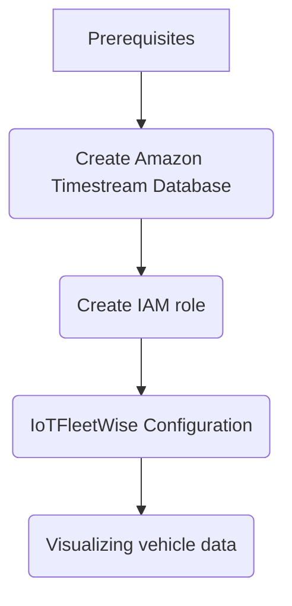

# Introduction of Amazon IoTFleetwise Deploy and Run
This section describes how to deploy and run AWS IoT FleetWise and trigger an campaign. The procedure is as follows:

Furture information plaese refer to [how AWS IoT FleetWise works](https://docs.aws.amazon.com/iot-fleetwise/latest/developerguide/how-iotfleetwise-works.html)
## Prerequisites
To configure the settings, you need the following AWS resources.
• You must use the same AWS Region when you create Timestream resources for AWS IoT FleetWise. If you switch AWS Regions, you might have issues accessing the Timestream resources. 
• AWS IoT FleetWise is available in US East (N. Virginia) and Europe (Frankfurt). 
• For the list of supported Regions, see Timestream endpoints and quotas in the AWS General Reference.
## Create Amazon Timestream Database
### Create a database
Follow these steps to create a database using the AWS Console.

1. Open the [AWS Timestream Console](AWS Console).
2. In the navigation pane, choose Databases
3. Click on Create database.
4. On the create database page, enter the following.
* Choose configuration—Select Standard database.
* Name—Enter a database name of your choice. *IoTFleetWiseDB-1669190634* in the demo.
* Encryption —Use the default option, where Timestream will create a KMS key in your account if one does not already exist.
8. Click on Create database to create a database.

### Create a table
Follow these steps to create a table using the AWS Console.

1. Open the [AWS Timestream Console](https://ap-northeast-1.console.aws.amazon.com/timestream/home?region=ap-northeast-1#databases).
2. In the navigation pane, choose Tables
3. Click on Create table.
4. On the create table page, enter the following.
* Database name—Select the name of the database created-*IoTFleetWiseDB-1669190634*.
* Table name—Enter a table name of your choice-*VehicleDataTable*.
* Memory store retention—Specify how long you want to retain data in the memory store. The memory store processes incoming data, including late arriving data (data with a timestamp earlier than the current time) and is optimized for fast point-in-time queries-*12 hours*.
* Magnetic store retention—Specify how long you want to retain data in the magnetic store. The magnetic store is meant for long term storage and is optimized for fast analytical queries-*10 days*.
9. Click on Create table.
##  Create IAM role
The creation refer to the [AWS IoT FleetWiseDeveloper Guide](https://docs.aws.amazon.com/iot-fleetwise/latest/developerguide/setting-up.html)
1. To create an IAM role, run the following command. 
• Replace AWSIoTFleetwisePreviewServiceRole with the name of the role you're creating. 
• Replace trust-policy with the JSON file that contains the trust policy
```
aws iam create-role --role-name AWSIoTFleetwisePreviewServiceRole --assume-role-policy-document file://trust-policy.json
```
Trust policy
```
{
  "Version": "2012-10-17",
  "Statement": [
    {
      "Effect": "Allow",
      "Principal": {
        "Service": "iotfleetwise.amazonaws.com"
      },
      "Action": "sts:AssumeRole"
    }
  ]
}
```
2. To create an IAM user policy, run the following command.

* Replace AWSIoTFleetwisePreviewIAMUserPolicy with the name of the policy you're creating.
* Replace iam-user-policy with the name of the JSON file that contains the IAM user policy.
```
aws iam create-policy --policy-name AWSIoTFleetwisePreviewIAMUserPolicy --policy-document file://iam-user-policy.json
```
IAM user policy
```
{
    "Version": "2012-10-17",
    "Statement": [
        {
            "Sid": "timestreamIngestion",
            "Effect": "Allow",
            "Action": [
                "timestream:WriteRecords",
                "timestream:Select"
            ],
            "Resource": "*"
        },
        {
            "Sid": "timestreamDescribeEndpoint",
            "Effect": "Allow",
            "Action": [
                "timestream:DescribeEndpoints"
            ],
            "Resource": "*"
        }
    ]
}
```
3. From the output, copy the Amazon Resource Name (ARN) of the IAM user policy.
4. To attach the IAM user policy to your IAM role, run the following command.
* Replace iam-user-policy-arn with the ARN that you copied in the previous step.
* Replace AWSIoTFleetwisePreviewServiceRole with the name of the IAM role that you created.
```
aws iam attach-role-policy --policy-arn iam-user-policy-arn --role-name AWSIoTFleetwisePreviewServiceRole
```
5. To create a permissions policy, run the following command.
* Replace AWSIoTFleetwiseAccessTimestreamPermissionsPolicy with the name of the policy you're creating.
* Replace permissions-policy with the name of the JSON file that contains the permissions policy.
```
aws iam create-policy --policy-name AWSIoTFleetwiseAccessTimestreamPermissionsPolicy --policy-document file://permissions-policy.json
```
Permissions policy
```
{
    "Version": "2012-10-17",
    "Statement": [
        {
            "Sid": "timestreamIngestion",
            "Effect": "Allow",
            "Action": [
                "timestream:WriteRecords",
                "timestream:Select"
            ],
            "Resource": "*"
        },
        {
            "Sid": "timestreamDescribeEndpoint",
            "Effect": "Allow",
            "Action": [
                "timestream:DescribeEndpoints"
            ],
            "Resource": "*"
        }
    ]
}
```
6. From the output, copy the ARN of the permissions policy.
7. To attach the IAM permissions policy to your IAM role, run the following command.
* Replace permissions-policy-arn with the ARN that you copied in the previous step.
* Replace AWSIoTFleetwisePreviewServiceRole with the name of the IAM role that you created.

```
aws iam attach-role-policy --policy-arn permissions-policy-arn --role-name AWSIoTFleetwisePreviewServiceRole
```
For more information, see [Access management for AWS resources](https://docs.aws.amazon.com/IAM/latest/UserGuide/access.html) in the IAM User Guide.
## IoTFleetWise Configuration
Key concepts
AWS IoT FleetWise provides a vehicle modeling framework for you to model your vehicle and its sensors and actuators in the cloud. To enable the secure communication between your vehicle and the cloud, AWS IoT FleetWise also provides a reference implementation to help you develop Edge Agent software that that you can install in your vehicle. You can define data collection schemes in the cloud and deploy them to your vehicle. The Edge Agent software running in your vehicle uses data collection schemes to control what data to collect and when to transfer it to the cloud.

The following are the core concepts of AWS IoT FleetWise.

Signal
Signals are fundamental structures that you define to contain vehicle data and its metadata. A signal can be an attribute, a branch, a sensor, or an actuator. For example, you can create a sensor to receive in-vehicle temperature values, and to store its metadata, including a sensor name, a data type, and a unit. For more information, see Create and manage signal catalogs.

Attribute
Attributes represent static information that generally doesn't change, such as manufacturer and manufacturing date.

Branch
Branches represent signals in a nested structure. Branches demonstrate signal hierarchies. For example, the Vehicle branch has a child branch, Powertrain. The Powertrain branch has a child branch, combustionEngine. To locate the combustionEngine branch, use the Vehicle.Powertrain.combustionEngine expression.

Sensor
Sensor data reports the current state of the vehicle and change over time, as the state of the vehicle changes, such as fluid levels, temperatures, vibrations, or voltage.

Actuator
Actuator data reports the state of a vehicle device, such as motors, heaters, and door locks. Changing the state of a vehicle device can update actuator data. For example, you can define an actuator to represent the heater. The actuator receives new data when you turn on or off the heater.

Signal catalog
A signal catalog contains a collection of signals. Signals in a signal catalog can be used to model vehicles that use different protocols and data formats. For example, there are two cars made by different automakers: one uses the Control Area Network (CAN bus) protocol; the other one uses the On-board Diagnostics (OBD) protocol. You can define a sensor in the signal catalog to receive in-vehicle temperature values. This sensor can be used to represent the thermocouples in both cars. For more information, see Create and manage signal catalogs.

Vehicle model (model manifest)
Vehicle models are declarative structures that you can use to standardize the format of your vehicles and to define relationships between signals in the vehicles. Vehicle models enforce consistent information across multiple vehicles of the same type. You add signals to create vehicle models. For more information, see Create and manage vehicle models.

Decoder manifest
Decoder manifests contain decoding information for each signal in vehicle models. Sensors and actuators in vehicles transmit low-level messages (binary data). With decoder manifests, AWS IoT FleetWise is able to transform binary data into human-readable values. Every decoder manifest is associated with a vehicle model. For more information, see Create and manage decoder manifests.

Network interface
Contains information about the protocol that the in-vehicle network uses. AWS IoT FleetWise supports the following protocols.

Controller Area Network (CAN bus)
A protocol that defines how data is communicated between electronic control units (ECUs). ECUs can be the engine control unit, airbags, or the audio system.

On-board diagnostic (OBD) II
A further developed protocol that defines how self-diagnostic data is communicated between ECUs. It provides a number of standard diagnostic trouble codes (DTCs) that help identify what is wrong with your vehicle.

Decoder signal
Provides detailed decoding information for a specific signal. Every signal specified in the vehicle model must be paired with a decoder signal. If the decoder manifest contains CAN network interfaces, it must contain CAN decoder signals. If the decoder manifest contains OBD network interfaces, it must contain OBD decoder signals.

Vehicle
A virtual representation of your physical vehicle, such a car or a truck. Vehicles are instances of vehicle models. Vehicles created from the same vehicle model inherit the same group of signals. Each vehicle corresponds to an AWS IoT thing.

Fleet
A fleet represents a group of vehicles. Before you can easily manage a fleet of vehicles, you must associate individual vehicles to a fleet.

Campaign
Contains data collection schemes. You define a campaign in the cloud and deploy it to a vehicle or fleet. Campaigns give the Edge Agent software instructions on how to select, collect, and transfer data to the cloud.

Data collection scheme
Data collection schemes give the Edge Agent software instructions on how to collect data. Currently, AWS IoT FleetWise supports the condition-based collection scheme and the time-based collection scheme.

Condition-based collection scheme
Use a logical expression to recognize what data to collect. The Edge Agent software collects data when the condition is met. For example, if the expression is $variable.myVehicle.InVehicleTemperature >35.0, the Edge Agent software collects temperature values that are greater than 35.0.

Time-based collection scheme
Specify a time period in milliseconds to define how often to collect data. For example, if the time period is 10,000 milliseconds, the Edge Agent software collects data once every 10 seconds.
### Configure IoTFleetWise settings(console)

1. In the AWS console, configure settings to transfer data to Amazon Timestream.
2. Navigate to the AWS IoT FleetWise console.
3. In the navigation pane, choose Settings.
4. On the Onboarding page, do the following:
* For Timestream database name, enter the name of your Timestream database-*IoTFleetWiseDB-1669190634*.
* For Timestream table name, enter the name of your Timestream table-*VehicleDataTable*.
* For Timestream access role, enter the ARN of the IAM role that you created.
5. Choose Submit.

After you update the settings, AWS automatically registers your AWS account, IAM role, and Timestream resources for the preview access. The registration status can be one of the following:

* REGISTRATION_SUCCESS – The AWS resource is successfully registered.
* REGISTRATION_PENDING – AWS IoT FleetWise is processing the registration request. This process takes approximately five minutes to complete.
* REGISTRATION_FAILURE – AWS IoT FleetWise can't register the AWS resource. Try again later.
### Create a vehicle model
1. Navigate to the [AWS IoT FleetWise console](https://console.aws.amazon.com/iotfleetwise/).
2. On the navigation pane, choose Vehicle models.
3. On the Vehicle models page, choose Create vehicle model, and then do the following

Step 1: Configure vehicle model

* Enter a name for the vehicle model-*IoTFleetwise-RDB2-Modelv2*.
* (Optional) Enter a description.
* Choose Next.

Step 2: Add signals
>Note
If this is the first time you've used AWS IoT FleetWise, this step isn't available until you have a signal catalog. When the first vehicle model is created, AWS IoT FleetWise automatically creates a signal catalog with signals added to the first vehicle model.
If you're experienced with AWS IoT FleetWise, you can add signals to your vehicle model by selecting signals from the signal catalog or uploading .dbc files to import signals.
You must have at least one signal to create a vehicle model.

* Choose one or more signals from the signal catalog that you're adding to the vehicle model. You can review selected signals in the right pane.
* Choose Next.

Step 3: Import signals

* Choose Choose files.
* In the dialog box, choose the .dbc file that contains signals. You can upload multiple .dbc files-[hscan.dbc](https://github.com/JimmySunCreater/AWS-IoTFleetwise-NXP-RDB2-Demo/blob/main/Fleetwise/hscan.dbc).
* AWS IoT FleetWise parses your .dbc files to retrieve signals.
* In the Signals section, specify the following metadata for each signal.
Data type – *DOUBLE* for all
(Optional) Path – *HSCANv2*
Dafault for other options.

Step 4: Add attributes
Key: *IotFleetWise* Value: *RDB2* Path: *HSCANv2*
Step 5: Review and create
Verify the configurations for the vehicle model, and then choose Create.
### Create a decoder manifest

1. Navigate to the AWS IoT FleetWise console.
2. On the navigation pane, choose *Vehicle models*.
3. Choose the target vehicle model.
4. On the vehicle model summary page, choose *Create decoder manifest*, and then do the following.

Step 1: Configure vehicle model
In General information, do the following.
* Enter a unique name for the decoder manifest-*IotFleetwise-RDB2-Decoderv2*.
* (Optional) Enter a description-*None*.
* Choose Next.

Step 2: Add network interfaces

* For Network interface type, choose the *CAN_INTERFACE*.
* Enter a unique name for your network interface-*can0*.
* Enter a unique network interface ID, use the ID generated by AWS IoT FleetWise-*This ID need to fill in the config-0.json file in RDB2*.
* Select all signals specified in your vehicle model to pair with decoder signals from *HSCANv2*.
* To provide decoding information, upload [hscan.dbc](https://github.com/JimmySunCreater/AWS-IoTFleetwise-NXP-RDB2-Demo/blob/main/Fleetwise/hscan.dbc) file. AWS IoT FleetWise parses the hscan.dbc file to retrieve decoder signals.
* In the Paired signals section, make sure that every signal is paired with a decoder signal.
* Choose Next.

Step 3: Review and create
Verify the configurations for the decoder manifest, and then choose Create.
### Create a vehicle (AWS CLI)
When you create a vehicle, you must use a vehicle model that is associated with a decoder manifest. You can use the CreateVehicle API operation to create a vehicle. The following example uses the AWS CLI.
```
aws iotfleetwise create-vehicle \
--vehicle-name fwdemo-s32g \
--model-manifest-arn <the arn of the model you created> \
--decoder-manifest-arn <the arn of the decoder you created> \
--association-Behavior CreateIotThing \
--attributes "HSCANv2.IoTFleetWise":"RDB2"
```
### Create a fleet (AWS CLI)
Use the CreateFleet API operation to create a vehicle fleet. 
```
aws iotfleetwise create-fleet \
   --fleet-id RDB2Demo \
   --description none \
   --signal-catalog-arn <signal-catalog-arn>
```
Use the AssociateVehicleFleet API operation to associate a vehicle with a fleet. 
```
aws iotfleetwise associate-vehicle-fleet --fleet-id RDB2Demo --vehicle-name fwdemo-s32g
```
### Collect and transfer data with campaigns
#### Create a campaign
Use the AWS IoT FleetWise console to create a campaign to select, collect, and transfer vehicle data to the cloud.
To create a campaign

1. Navigate to the AWS IoT FleetWise console.
2. On the navigation pane, choose Campaigns.
3. On the campaign summary page, choose Create campaign, and then do the following:

Step 1: Configure campaign

* Enter a name for the campaign-*IoTFleetwise-RDB2-TimebasedCollection-v2*.
* (Optional) Enter a description-None.
* Choose Next.

Step 2: Search vehicle attributes
To choose which vehicles to deploy your campaign to, search for the attributes and their values that you added when creating the vehicles.

* Enter the attribute's fully qualified name- HSCANv2.IoTFleetWise=RDB2
* You should get the vehicle name-*fedemo-s32g*
* Choose Next.

Step 3: Configure data collection scheme
A campaign's data collection scheme gives the Edge Agent software instructions on what data to collect or when to collect it.This demo manually specify the type of data collection scheme and define options to customize the scheme.

* Choose-*Time-based*
* Choose-*Default duration*
* Period-*10000*
* Advanced scheme options- *all by default*
* Signals to collect-*select all the signals start with HSCANv2.*
* Max sample count/Min sampling interval-*all by default*

Step 4: Review and create
Verify the configurations for the campaign, and then choose Create.
Step 5: Approve a campaign
After you create a campaign, you or your team must approve the campaign before AWS IoT FleetWise can deploy it to vehicles.
On the Campaign summary page, choose Approve.

## Visualizing vehicle data
The data can be visualized by Timestream by query and can be visualized by Grafana once it's ready.