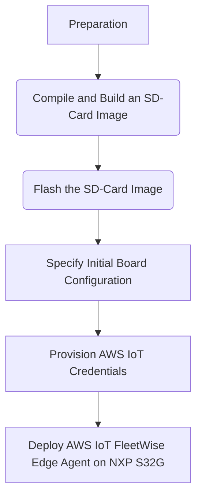

# Introduction of RDB2 Deploy and Run
This section describes how to deploy and run AWS IoT FleetWise Edge Agent onto an NXP S32G-VNP-RDB2 board to collect data from CARLA. The procedure is as follows:



## Prerequisites

* NXP Semiconductors S32G Reference Design 2 — Part number: [S32G-VNP-RDB2](https://www.nxp.com/design/designs/s32g2-vehicle-networking-reference-design:S32G-VNP-RDB2)
* Internet Router with Ethernet — The S32G-VNP-RDB2 must be connected to an internet router via an Ethernet cable for internet connectivity.Inter face P3A is used to connect to a router.
* Access to an AWS Account with administrator privileges.
## Compile and Build an SD-Card Image
AWS IoT FleetWise Edge Agent software provides C++ libraries that enable you to run the application on your vehicle. The agent is deployed at RDB2 in this demo. 
It's recommanded to use an [AWS EC2 Graviton](https://aws.amazon.com/cn/ec2/graviton/) (arm64) instance to compile and build SD-Card Image for RDB2 becauce Graviton have same arm64 archetecture with RDB2 which makes high consistency of software and hardware and enable rapid migration.The development machine is AWS EC2 Graviton in the demo.
### Launch development machine
An Ubuntu 18.04 development machine with 200GB free disk space will be required. Use the following instructions to launch an AWS EC2 Graviton (arm64) instance.
1. Launch an EC2 Graviton instance with administrator permissions: [Launch CloudFormation Template](https://us-east-1.console.aws.amazon.com/cloudformation/home?region=us-east-1#/stacks/quickcreate?templateUrl=https%3A%2F%2Faws-iot-fleetwise.s3.us-west-2.amazonaws.com%2Flatest%2Fcfn-templates%2Ffwdev.yml&stackName=fwdev).
2. Enter the Name of an existing SSH key pair in your account from [here](https://us-east-1.console.aws.amazon.com/ec2/v2/home?region=us-east-1#KeyPairs:).
>* Do not include the file suffix .pem.
>
>* If you do not have an SSH key pair, you will need to create one and download the corresponding .pem file. Be sure to update the file permissions: chmod 400 <PATH_TO_PEM>
3. Select the checkbox next to ‘I acknowledge that AWS CloudFormation might create IAM resources with custom names.’
4. Choose Create stack.
5. Wait until the status of the Stack is CREATE_COMPLETE; this can take up to five minutes.
6. Select the Outputs tab, copy the EC2 IP address, and connect via SSH from your local machine to the development machine.
```
ssh -i <PATH_TO_PEM> ubuntu@<EC2_IP_ADDRESS>
```
### Compile AWS IoT FleetWise Edge Agent software
1. Run the following on the development machine to clone the latest AWS IoT FleetWise Edge Agent software from GitHub.
```
git clone https://github.com/aws/aws-iot-fleetwise-edge.git ~/aws-iot-fleetwise-edge \
    && cd ~/aws-iot-fleetwise-edge
```
2. Install the AWS IoT FleetWise Edge Agent dependencies
Commands below will:

* Install the following Ubuntu packages: libssl-dev libboost-system-dev libboost-log-dev libboost-thread-dev build-essential cmake unzip git wget curl zlib1g-dev libcurl4-openssl-dev libsnappy-dev default-jre libasio-dev. Additionally it installs the following: jsoncpp protobuf aws-sdk-cpp
* Install the following Ubuntu packages: build-essential dkms can-utils git linux-modules-extra-aws. Additionally it installs the following: can-isotp. It also installs a systemd service called setup-socketcan that brings up the virtual SocketCAN interface vcan0 at startup.
* Install the following Ubuntu packages: python3.7 python3-setuptools curl. It then installs Python PIP for Python 3.7 and the following PIP packages: wrapt cantools prompt_toolkit python-can can-isotp matplotlib. It also installs a systemd service called cansim that periodically transmits data on the virtual SocketCAN bus vcan0 to simulate vehicle data.
```
sudo -H ./tools/install-deps-native.sh \
    && sudo -H ./tools/install-socketcan.sh \
    && sudo -H ./tools/install-cansim.sh
```
3. Run the following to compile AWS IoT FleetWise Edge Agent software:
```
./tools/build-fwe-native.sh
```
### Build an SD-Card Image
The following instructions use the development machine to build an SD-card image based on the Ubuntu variant of the NXP Linux BSP version 28.0, with the addition of the can-isotp kernel module required by AWS IoT FleetWise Edge Agent, an updated version of the canutils package and a systemd service called setup-socketcan for bringing up the CAN interfaces at startup.

1. Run the following on the development machine to install the dependencies of the bitbake tool of the Yocto / OpenEmbedded project.
```
cd ~/aws-iot-fleetwise-edge \
    && sudo ./tools/install-deps-yocto.sh
```
2. Run the following to create a build folder and setup the Yocto project:
```
mkdir -p ~/yocto-build && cd ~/yocto-build \
    && ~/aws-iot-fleetwise-edge/tools/setup-yocto-s32g.sh
```
3. Run the following to run bitbake to create the SD-card image and compress it. This can take several hours to complete depending on the performance of the development machine and the speed of the internet connection.
```
source sources/poky/oe-init-build-env build_s32g274ardb2ubuntu \
    && bitbake fsl-image-ubuntu \
    && gzip -fk tmp/deploy/images/s32g274ardb2/fsl-image-ubuntu-s32g274ardb2.sdcard
```
4. Run the following on your local machine to download the compressed SD-card image:
```
scp -i <PATH_TO_PEM> ubuntu@<EC2_IP_ADDRESS>:yocto-build/build_s32g274ardb2ubuntu/tmp/deploy/images/s32g274ardb2/fsl-image-ubuntu-s32g274ardb2.sdcard.gz .
```
>The process of building SD-Card image will take 3~4 hours,the size of the image is 6.2GB. If you need the compiled image, please contact sunjimmy@amazon.com or you can do it by yourself.

## Flash the SD-Card Image

1. Download and install Balena Etcher on your local machine: [https://www.balena.io/etcher/](https://www.balena.io/etcher/)
2. Run Balena Etcher, choose ‘Select image’ and select the compressed SD-card image fsl-image-ubuntu-s32g274ardb2.sdcard.gz
3. Insert the SD-card supplied with the S32G-VNP-RDB2 into your local machine’s SD-card reader
4. Choose ‘Select target’ and select the SD-card
5. Choose ‘Flash!’
## Specify Initial Board Configuration

1. Insert the SD-card into the S32G-VNP-RDB2’s SD-card slot.
2. Switch Setting for SD card Boot

3. Connect the S32G-VNP-RDB2’s power supply.
4. Connect an Ethernet cable from port P3A of the S32G-VNP-RDB2 to the internet router.
5. Connect your local machine to the internet router, for example via WiFi or via Ethernet.
6. Connect to the S32G-VNP-RDB2 via SSH, entering password bluebox: ssh bluebox@ubuntu-s32g274ardb2
>If you can’t connect using the hostname ubuntu-s32g274ardb2, you will need to connect to the administration webpage of the internet router to obtain the IP address assigned to the S32G-VNP-RDB2. Use this IP address in place of ubuntu-s32g274ardb2 used throughout this guide.
7. Once connected via SSH, check the board’s internet connection by running: ping amazon.com. There should be 0% packet loss.

## Provision AWS IoT Credentials
Run the following commands on the development machine (after compiling AWS IoT FleetWise Edge Agent for ARM64 as explained above), to create an IoT Thing and provision credentials for it. The AWS IoT FleetWise Edge Agent binary and its configuration files will be packaged into a ZIP file ready to be deployed to the board.
```
mkdir -p ~/aws-iot-fleetwise-deploy && cd ~/aws-iot-fleetwise-deploy \
&& cp -r ~/aws-iot-fleetwise-edge/tools . \
&& mkdir -p build/src/executionmanagement \
&& cp ~/aws-iot-fleetwise-edge/build/src/executionmanagement/aws-iot-fleetwise-edge \
  build/src/executionmanagement/ \
&& mkdir -p config && cd config \
&& ../tools/provision.sh \
  --vehicle-name fwdemo-s32g \
  --certificate-pem-outfile certificate.pem \
  --private-key-outfile private-key.key \
  --endpoint-url-outfile endpoint.txt \
  --vehicle-name-outfile vehicle-name.txt \
&& ../tools/configure-fwe.sh \
  --input-config-file ~/aws-iot-fleetwise-edge/configuration/static-config.json \
  --output-config-file config-0.json \
  --vehicle-name `cat vehicle-name.txt` \
  --endpoint-url `cat endpoint.txt` \
  --can-bus0 can0 \
&& cd .. && zip -r aws-iot-fleetwise-deploy.zip .
```
## Deploy AWS IoT FleetWise Edge Agent on NXP S32G

1. Run the following on your local machine to copy the deployment ZIP file from the EC2 machine to your local machine:
```
scp -i <PATH_TO_PEM> ubuntu@<EC2_IP_ADDRESS>:aws-iot-fleetwise-deploy/aws-iot-fleetwise-deploy.zip .
```
2. Run the following on your local machine to copy the deployment ZIP file from your local machine to the S32G (replacing ubuntu-s32g274ardb2 with the IP address of the S32G if using the hostname is not supported):
```
scp aws-iot-fleetwise-deploy.zip bluebox@ubuntu-s32g274ardb2:
```
3. SSH to the S32G board, as described above, then run the following on the S32G to install AWS IoT FleetWise Edge Agent as a service:
```
mkdir -p ~/aws-iot-fleetwise-deploy && cd ~/aws-iot-fleetwise-deploy \
    && unzip -o ~/aws-iot-fleetwise-deploy.zip \
    && sudo mkdir -p /etc/aws-iot-fleetwise \
    && sudo cp config/* /etc/aws-iot-fleetwise \
    && sudo ./tools/install-fwe.sh
```
4. Configure decoder interface
```
sudo vim /etc/aws-iot-fleetwise/config-0.json
```
Modify the interfaceId as follows
```
"networkInterfaces": [
    {
      "canInterface": {
        "interfaceName": "vcan0",
        "protocolName": "CAN",
        "protocolVersion": "2.0B"
      },
      "interfaceId": "the ID of IoTFleetwise decoder manifest interface",
      "type": "canInterface"
    }
```
5. Run the following on the S32G to view and follow the AWS IoT FleetWise Edge Agent log (press CTRL+C to exit):
```
sudo journalctl -fu fwe@0
```